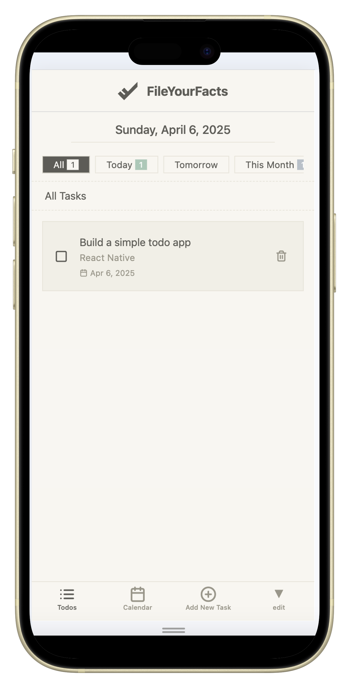

# FileYourFacts Todo App

A minimalist todo app built with React Native and Expo. 
This elegant task management tool helps you organize your daily activities with a clean, paper-like interface.

## Features

- ✅ Create, edit, and delete tasks with an intuitive interface
- 📅 Set deadlines with a user-friendly calendar picker
- 🔍 Filter tasks by multiple criteria:
    - Status (Planned, Pending, Done, Overdue)
    - Time periods (Today, Tomorrow, This Month)
    - View all tasks at once
- 📱 Responsive design that works seamlessly on both mobile and web
- 📊 Calendar view to visualize tasks by date
- 🎨 Clean, paper-inspired design with attention to typography and spacing

## Technologies Used

- **React Native** - Cross-platform mobile framework
- **Expo** - Development platform for React Native
- **Expo Router** - File-based routing system
- **Zustand** - Lightweight state management
- **date-fns** - Modern JavaScript date utility library
- **React Native Calendars** - Customizable calendar component
- **React Native SVG** - SVG support for the logo and icons

## Screenshots

<div>
  
</div>

## How to Run

### Prerequisites

- Node.js (v14 or newer)
- npm or yarn
- Expo CLI: `npm install -g expo-cli`
- Expo Go app on your mobile device (available on [iOS App Store](https://apps.apple.com/app/expo-go/id982107779) or [Google Play Store](https://play.google.com/store/apps/details?id=host.exp.exponent))

### Installation

1. Clone this repository:
   ```bash
   git clone https://github.com/YOUR_USERNAME/fileyourfacts-todo-app.git
   cd fileyourfacts-todo-app

## Author

[Marianne Poliakov]